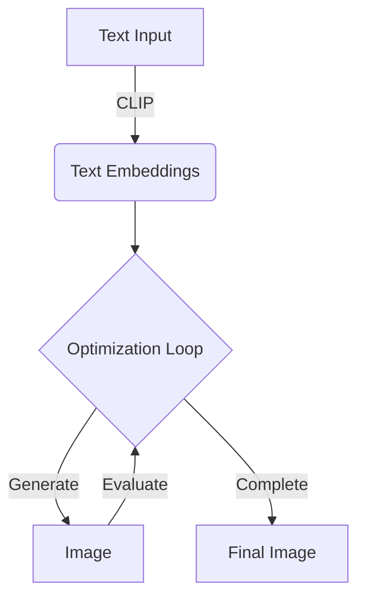
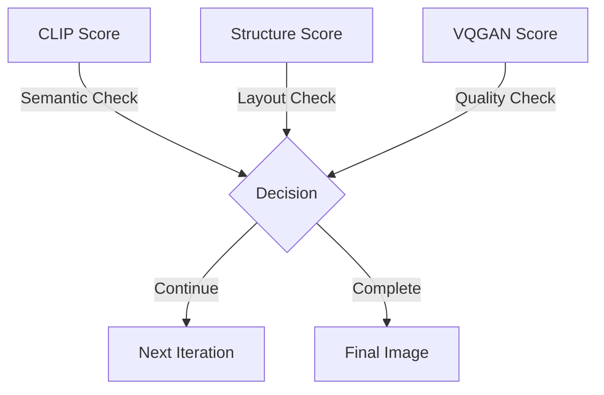

<div align="center">

# 🎨 Text to Image Generation Web App

[](https://reactjs.org/)
[](https://fastapi.tiangolo.com/)
[](https://www.python.org/)
[](https://nodejs.org/)

<p align="center">
  
  
  
</p>

A cutting-edge web application that transforms text descriptions into stunning images using CLIP, VQGAN, and Taming Transformer models. Features an immersive 3D particle background, smooth animations, and real-time generation display.

</div>

<div align="center">

## ✨ Demonstration

### 🌟 Web Application Interface
Experience our modern web interface with an immersive 3D particle background:

<div style="position: relative;">
<video width="100%" controls autoplay loop muted style="border-radius: 10px; box-shadow: 0 8px 16px rgba(0,0,0,0.1); margin: 20px 0;">
  <source src="_asserts/app ui.mp4" type="video/mp4">
  Your browser does not support the video tag.
</video>
</div>

<details>
<summary style="cursor: pointer; color: #4CAF50; font-weight: bold;">✨ Key Interface Features</summary>

<div style="background: linear-gradient(135deg, rgba(76, 175, 80, 0.1), rgba(76, 175, 80, 0.05)); padding: 20px; border-radius: 10px; margin: 10px 0;">

- 🎮 Immersive 3D Particle Background
- ⌨️ Intuitive Text Input Interface
- 🔄 Real-time Generation Progress
- 🎛️ Interactive Parameter Controls
- 🌟 Animated Star Cursor Effects
- 🎨 Modern Glassmorphism Design

</div>
</details>

### 🔬 Training Progress
Watch our model evolve in creating a "sunset time at the beach" scene:

<div style="position: relative;">
<video width="100%" controls autoplay loop muted style="border-radius: 10px; box-shadow: 0 8px 16px rgba(0,0,0,0.1); margin: 20px 0;">
  <source src="_asserts/training result.mp4" type="video/mp4">
  Your browser does not support the video tag.
</video>
</div>

<details>
<summary style="cursor: pointer; color: #FF6B6B; font-weight: bold;">🌅 Training Evolution Details</summary>

<div style="background: linear-gradient(135deg, rgba(255, 107, 107, 0.1), rgba(255, 107, 107, 0.05)); padding: 20px; border-radius: 10px; margin: 10px 0;">

1. **Initial Stage** 🌅
   - Basic shape formation
   - Sun placement and initial beach outlines
   
2. **Development Stage** 🏖️
   - Beach texture refinement
   - Advanced lighting effects
   
3. **Final Stage** 👥
   - Human figure integration
   - Detailed clothing with grain and red color

> 💡 Note: Training visualization shown in development environment due to GPU constraints

</div>
</details>

</div>

## 🚀 Getting Started

### 📋 Prerequisites

<div style="display: grid; grid-template-columns: repeat(3, 1fr); gap: 20px; margin: 20px 0;">

<div style="background: linear-gradient(135deg, #3776AB22, #3776AB11); padding: 15px; border-radius: 10px; text-align: center;">

</div>

<div style="background: linear-gradient(135deg, #33993322, #33993311); padding: 15px; border-radius: 10px; text-align: center;">

</div>

<div style="background: linear-gradient(135deg, #CB344422, #CB344411); padding: 15px; border-radius: 10px; text-align: center;">

</div>

</div>

### ⚙️ Installation

<div style="background: linear-gradient(135deg, #2196F322, #2196F311); padding: 20px; border-radius: 10px; margin: 20px 0;">

<details>
<summary style="cursor: pointer; font-weight: bold;">1️⃣ Install Python Dependencies</summary>

```bash
pip install -r requirements.txt
```
</details>

<details>
<summary style="cursor: pointer; font-weight: bold;">2️⃣ Install Node.js Dependencies</summary>

```bash
# Install concurrently globally
npm install -g concurrently

# Install project dependencies
cd web_app
npm install
```
</details>

</div>

## 🤖 Model Setup

<div style="background: linear-gradient(135deg, #FF6B6B22, #4ECDC422); padding: 20px; border-radius: 10px; margin: 20px 0;">

<h4>📁 Model Directory Structure</h4>

```
models/
├── 🧠 clip/                            # OpenAI's CLIP model
├── 🔄 taming_transformer/              # CompVis Taming Transformer
└── 🎨 vqgan_imagenet_f16_16384/       # VQGAN model
    ├── checkpoints/
    │   └── last.ckpt
    └── configs/
        └── model.yaml
```

</div>

## 🚀 Launch Application

<div style="background: linear-gradient(135deg, #4CAF5022, #4CAF5011); padding: 20px; border-radius: 10px; margin: 20px 0;">

<details>
<summary style="cursor: pointer; font-weight: bold;">🔄 Option 1: All-in-One Start</summary>

```bash
cd web_app
npm run start
```
</details>

<details>
<summary style="cursor: pointer; font-weight: bold;">🔀 Option 2: Separate Services</summary>

<h4>Backend: 🔧</h4>

```bash
cd fastapi_app
uvicorn main:app --reload --port 8000
```

<h4>Frontend: 🎨</h4>

```bash
cd web_app
npm run dev
```
</details>

<h4>🌐 Access Points</h4>

<div style="display: grid; grid-template-columns: repeat(2, 1fr); gap: 10px; margin: 10px 0;">

<div style="background: linear-gradient(135deg, #4CAF5033, #4CAF5022); padding: 10px; border-radius: 8px; text-align: center;">
💻 Frontend: http://localhost:3000
</div>

<div style="background: linear-gradient(135deg, #2196F333, #2196F322); padding: 10px; border-radius: 8px; text-align: center;">
⚙️ API: http://localhost:8000
</div>

</div>

</div>

## 🏗️ Architecture

<div style="background: linear-gradient(135deg, #9C27B022, #9C27B011); padding: 20px; border-radius: 10px; margin: 20px 0;">

### 🧩 Model Components

<div style="display: grid; grid-template-columns: repeat(3, 1fr); gap: 20px; margin: 20px 0;">

<div style="background: linear-gradient(135deg, #FF6B6B22, #FF8E5322); padding: 20px; border-radius: 10px;">

#### 🎯 CLIP
- 🧠 OpenAI's Vision-Language Model
- 📊 32B Parameter Architecture
- 🔍 Text-Image Understanding
</div>

<div style="background: linear-gradient(135deg, #4ECDC422, #55627022); padding: 20px; border-radius: 10px;">

#### 🎨 VQGAN
- 🖼️ ImageNet-trained Generator
- 🔢 Discrete Latent Codes
- ✨ High-quality Image Synthesis
</div>

<div style="background: linear-gradient(135deg, #9B59B622, #8E44AD22); padding: 20px; border-radius: 10px;">

#### 🔄 Taming Transformer
- 🏗️ CompVis Architecture
- 📈 High-Resolution Output
- 🔗 VQGAN Integration
</div>

</div>

### 🔄 Generation Flow

<div style="background: linear-gradient(135deg, #00968822, #00968811); padding: 20px; border-radius: 10px; margin: 20px 0;">



</div>


## 🎯 Deep Dive: Model Interaction & Image Generation

<div style="background: linear-gradient(135deg, #FF8C0022, #FF8C0011); padding: 20px; border-radius: 10px; margin: 20px 0;">

### 🔄 Detailed Model Pipeline

#### 1️⃣ CLIP's Dual-Encoder Architecture

<div style="background: linear-gradient(135deg, #4A90E222, #4A90E211); padding: 20px; border-radius: 10px; margin: 10px 0;">

##### A. Text Encoding
```math
\begin{aligned}
\text{tokens} &= \text{Tokenizer}(\text{"sunset at beach"}) \\
E_{\text{text}} &= \text{CLIP}_{\text{text}}(\text{tokens}) \in \mathbb{R}^{512}
\end{aligned}
```

##### B. Image Encoding
```math
\begin{aligned}
E_{\text{image}} &= \text{CLIP}_{\text{vision}}(x_t) \in \mathbb{R}^{512} \\
\text{similarity} &= \frac{E_{\text{text}} \cdot E_{\text{image}}}{\|E_{\text{text}}\| \|E_{\text{image}}\|}
\end{aligned}
```

##### C. Alignment Feedback
```math
\begin{aligned}
\mathcal{L}_{\text{align}} &= 1 - \text{similarity} \\
\text{direction} &= \nabla_{x_t}\mathcal{L}_{\text{align}} \in \mathbb{R}^{3 \times H \times W}
\end{aligned}
```

This gradient (direction) tells us how to modify the image to better match the text.

</div>

#### 2️⃣ Taming Transformer: The Structural Bridge

<div style="background: linear-gradient(135deg, #2ECC7122, #2ECC7111); padding: 20px; border-radius: 10px; margin: 10px 0;">

##### A. Semantic Layout Generation
```math
\begin{aligned}
\text{Layout}_{\text{tokens}} &= \text{Transformer}_{\text{encode}}(E_{\text{text}}) \\
\text{where tokens} &\in \mathbb{R}^{N \times D_{\text{model}}}
\end{aligned}
```

The transformer converts text embeddings into a sequence of spatial tokens.

##### B. Cross-Attention Mechanism
```math
\begin{aligned}
Q &= W_Q\text{Layout}_{\text{tokens}} \\
K &= W_K\text{CLIP}_{\text{features}} \\
V &= W_V\text{VQGAN}_{\text{features}} \\
\text{Attention} &= \text{softmax}(\frac{QK^T}{\sqrt{d_k}})V
\end{aligned}
```

This mechanism:
1. Takes CLIP's text understanding
2. Correlates it with VQGAN's visual features
3. Guides where specific elements should appear

##### C. Spatial-Semantic Layout
```math
\begin{aligned}
\text{Layout}_{\text{map}} &= \begin{bmatrix}
s_{11} & s_{12} & \cdots & s_{1n} \\
s_{21} & s_{22} & \cdots & s_{2n} \\
\vdots & \vdots & \ddots & \vdots \\
s_{m1} & s_{m2} & \cdots & s_{mn}
\end{bmatrix} \\
\text{where } s_{ij} &= \begin{bmatrix}
\text{semantic}_{\text{feature}} \\
\text{position}_{\text{encoding}} \\
\text{attention}_{\text{weight}}
\end{bmatrix}
\end{aligned}
```

##### D. Feature Composition
```math
\begin{aligned}
\text{Composition} &= \text{Transformer}_{\text{decode}}(\text{Layout}_{\text{map}}) \\
\mathcal{L}_{\text{structure}} &= \begin{cases}
\|\text{Composition} - \text{Target}\|_2^2 & \text{global structure} \\
\sum_{i,j} \text{CrossEntropy}(s_{ij}, t_{ij}) & \text{local features}
\end{cases}
\end{aligned}
```

The transformer acts as an intelligent mediator:
- Maps semantic concepts to spatial locations
- Ensures global composition makes sense
- Maintains local feature consistency

</div>

#### 3️⃣ VQGAN: Bringing Structure to Life

<div style="background: linear-gradient(135deg, #E74C3C22, #E74C3C11); padding: 20px; border-radius: 10px; margin: 10px 0;">

##### A. Vector Quantization
```math
\begin{aligned}
z &= E(x) \text{ (encoder)} \\
z_q &= \text{quantize}(z) \\
\text{where quantize}(z) &= \arg\min_{c_k \in \mathcal{C}} \|z - c_k\|_2
\end{aligned}
```

##### B. Image Synthesis
```math
\begin{aligned}
x_{\text{reconstructed}} &= G(z_q) \text{ (decoder)} \\
\mathcal{L}_{\text{reconstruction}} &= \|x - x_{\text{reconstructed}}\|_2^2 \\
\mathcal{L}_{\text{perceptual}} &= \|\phi(x) - \phi(x_{\text{reconstructed}})\|_2^2
\end{aligned}
```

</div>

### 🔄 Complete Generation Loop

1. **Initial Phase**
```math
\begin{aligned}
E_{\text{text}} &= \text{CLIP}_{\text{text}}(\text{prompt}) \\
\text{Layout} &= \text{TamingTransformer}(E_{\text{text}}) \\
z_0 &\sim \mathcal{N}(0, 1)^{16 \times 16 \times 256}
\end{aligned}
```

2. **Iterative Refinement**
```math
\begin{aligned}
\text{For each step } t&: \\
x_t &= \text{VQGAN}_{\text{decode}}(z_t) \\
E_{\text{image}} &= \text{CLIP}_{\text{vision}}(x_t) \\
\text{Layout}_t &= \text{TamingTransformer}(x_t) \\
\mathcal{L}_{\text{total}} &= \begin{bmatrix}
\alpha\mathcal{L}_{\text{CLIP}} \\
+ \beta\mathcal{L}_{\text{structure}} \\
+ \gamma\mathcal{L}_{\text{reconstruction}}
\end{bmatrix} \\
z_{t+1} &= z_t - \eta \cdot \text{Adam}(\nabla_{z_t}\mathcal{L}_{\text{total}})
\end{aligned}
```

3. **Quality Control Flow**


### 📊 Inter-Model Communication

<div style="background: linear-gradient(135deg, #9B59B622, #9B59B611); padding: 20px; border-radius: 10px; margin: 10px 0;">

```math
\begin{aligned}
\text{CLIP} &\xrightarrow{\text{semantic guidance}} \text{Taming Transformer} \\
\text{Taming Transformer} &\xrightarrow{\text{spatial layout}} \text{VQGAN} \\
\text{VQGAN} &\xrightarrow{\text{generated image}} \text{CLIP} \\
\text{forming a cycle}: &\\
\text{Text} \xrightarrow{\text{CLIP}} &\text{Layout} \xrightarrow{\text{Transform}} \text{Image} \xrightarrow{\text{VQGAN}} \text{Evaluate} \xrightarrow{\text{CLIP}} \text{Refine}
\end{aligned}
```

</div>

</div>


</div>

## 🛠️ API Reference

<div style="background: linear-gradient(135deg, #E9118822, #E9118811); padding: 20px; border-radius: 10px; margin: 20px 0;">

### POST /generate

<details>
<summary style="cursor: pointer; font-weight: bold;">📝 Request Format</summary>

```json
{
  "prompt": "string",
  "num_steps": "integer (10-200)",
  "guidance_scale": "float (default: 7.5)"
}
```
</details>

<details>
<summary style="cursor: pointer; font-weight: bold;">📤 Response Format</summary>

```json
{
  "progress_images": [
    {
      "step": "integer",
      "total_steps": "integer",
      "image": "base64 string"
    }
  ],
  "final_image": "base64 string"
}
```
</details>

</div>

## ❓ Troubleshooting

<div style="background: linear-gradient(135deg, #FF572222, #FF572211); padding: 20px; border-radius: 10px; margin: 20px 0;">

<details>
<summary style="cursor: pointer; font-weight: bold;">🔧 Common Issues</summary>

1. **"concurrently is not recognized"**
   ```bash
   npm install -g concurrently
   ```

2. **Blank Page Issues**
   - ✅ Check both servers
   - 🔄 Clear cache & reload
   - 🔍 Check console logs

3. **Model Loading Errors**
   - 📁 Verify model file locations
   - 🔍 Check file structure
   - ⬇️ Confirm downloads

</details>

</div>


## 📜 License

<div style="background: linear-gradient(135deg, #20202022, #20202011); padding: 20px; border-radius: 10px; margin: 20px 0;">

This project is licensed under the MIT License:

```
MIT License

Copyright (c) 2024 Aman Agrawal

Permission is hereby granted, free of charge, to any person obtaining a copy
of this software and associated documentation files (the "Software"), to deal
in the Software without restriction, including without limitation the rights
to use, copy, modify, merge, publish, distribute, sublicense, and/or sell
copies of the Software, and to permit persons to whom the Software is
furnished to do so, subject to the following conditions:

The above copyright notice and this permission notice shall be included in all
copies or substantial portions of the Software.

THE SOFTWARE IS PROVIDED "AS IS", WITHOUT WARRANTY OF ANY KIND, EXPRESS OR
IMPLIED, INCLUDING BUT NOT LIMITED TO THE WARRANTIES OF MERCHANTABILITY,
FITNESS FOR A PARTICULAR PURPOSE AND NONINFRINGEMENT. IN NO EVENT SHALL THE
AUTHORS OR COPYRIGHT HOLDERS BE LIABLE FOR ANY CLAIM, DAMAGES OR OTHER
LIABILITY, WHETHER IN AN ACTION OF CONTRACT, TORT OR OTHERWISE, ARISING FROM,
OUT OF OR IN CONNECTION WITH THE SOFTWARE OR THE USE OR OTHER DEALINGS IN THE
SOFTWARE.
```

</div>

## 🙏 Acknowledgments

<div style="background: linear-gradient(135deg, #6C348322, #6C348311); padding: 20px; border-radius: 10px; margin: 20px 0;">

Special thanks to:

- [OpenAI](https://openai.com) for the CLIP model
- [CompVis](https://github.com/CompVis) for the Taming Transformer
- The VQGAN team for their groundbreaking work
- The open-source community for their invaluable contributions

This project combines cutting-edge AI models to create a unique text-to-image generation experience. We're grateful to all researchers and developers who made this possible.

### 📞 Contact

For any inquiries or suggestions, feel free to reach out:

[](https://www.linkedin.com/in/your-profile)
[](https://github.com/your-username)

</div>

---

<div align="center">
<p style="color: #666; font-style: italic;">Made with ❤️ by Aman Agrawal</p>


</div>
